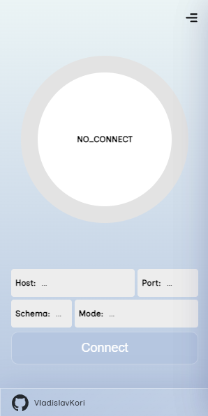

## SmartProxy

## How Install?
You need to clone the repository to your computer, then you need to open ``chrome://extentions``, enable "developer mode" and load the extension by clicking the "Load" button. Now you can use this extension, the interface of which is located in the top right corner of your browser.